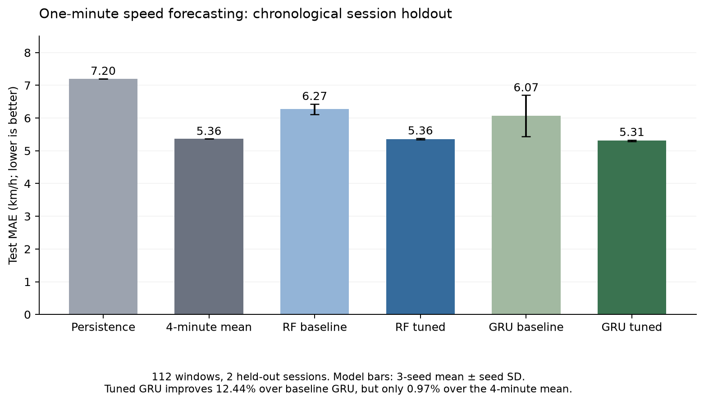
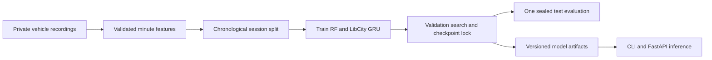

# Expressway Traffic Forecasting

**Reproduce a baseline, diagnose noisy targets, and ship a smaller forecasting model.**

An internship-derived traffic analytics project extended with a reproducible Random Forest / PyTorch GRU benchmark and a validated FastAPI inference service. The concrete task is to predict the **next minute's mean vehicle speed from the previous four minutes** for offline construction-road monitoring.



## Measured results

Chronological recording-level split: **6,418 source vehicle rows → 132 training / 82 validation / 112 test windows**. The final two recording sessions were held out; all model selection used validation only. ML/DL scores are means over seeds 17, 42 and 73.

| Model | Test MAE, km/h ↓ | Test RMSE, km/h ↓ | MAE improvement vs own baseline |
|---|---:|---:|---:|
| Persistence | 7.201 | 9.336 | — |
| Four-minute moving mean | 5.365 | 7.125 | — |
| Random Forest baseline | 6.270 | 8.026 | — |
| Regularized residual Random Forest | **5.362** | 7.120 | **14.49%** |
| LibCity GRU Seq2Seq baseline | 6.067 | 7.748 | — |
| Compact mean-residual GRU | **5.312** | **7.077** | **12.44%** |

The tuned GRU uses **609 parameters vs 26,369 (97.69% fewer)**. Its MAE seed standard deviation fell from 0.630 to 0.021 km/h on this benchmark. The simple moving mean is already strong: the GRU improves on it by only **0.97%**. This small retrospective study does not establish deployment impact or statistical superiority on other roads.

[Full test results](docs/forecasting/test_report.json) · [Search history](docs/forecasting/selection.json) · [Protocol](docs/forecasting/PROTOCOL.md) · [Model card](docs/forecasting/MODEL_CARD.md)

## What changed and why

1. **Rebuilt the data pipeline from source recordings.** Bypass stale intermediate CSVs, remove duplicate vehicle rows, exclude partial boundary minutes, validate gaps, and preserve whole recording sessions across chronological splits. Feature normalization uses training data only.
2. **Reproduced two representative model families.** A scikit-learn Random Forest provides a nonlinear tabular baseline; the inherited LibCity GRU Seq2Seq provides a recurrent baseline under the same input/target protocol.
3. **Used validation evidence to change the model.** A last-value residual model did not help. The second search learned small corrections around the four-minute mean, controlled tree complexity, reduced GRU hidden size from 64 to 8, and used Huber loss and weight decay. Both search rounds and all seeds are retained.
4. **Made inference usable.** Removed the future-label requirement in Seq2Seq, added opt-in deterministic initialization, and packaged train-serving-consistent normalization, schema validation, model loading at startup, `/health`, `/predict`, and regression tests.



## Run the included model — no private data required

Python 3.12 is the tested runtime. The focused requirements install dependencies for this extension; the upstream all-model requirements are unnecessary.

```bash
python -m venv .venv
source .venv/bin/activate
pip install -r requirements-forecasting.txt
python -m traffic_forecasting.inference \
  --artifact artifacts/forecasting/gru_mean_1.joblib --family gru \
  --request docs/forecasting/example_request.json
```

Model artifacts were generated by the included training code. `joblib` is pickle-based: load only trusted artifacts. Input fields and timestamps are validated; the sample request is synthetic.

```bash
TRAFFIC_MODEL_PATH=artifacts/forecasting/gru_mean_1.joblib \
  uvicorn traffic_forecasting.api:create_app --factory --host 127.0.0.1 --port 8000
curl http://127.0.0.1:8000/health
curl -X POST http://127.0.0.1:8000/predict \
  -H 'Content-Type: application/json' \
  --data-binary @docs/forecasting/example_request.json
```

The service is a local demonstration. It does not implement a deployed alert policy, authentication gateway, monitoring infrastructure or production scaling.

## Reproduce training with authorized source data

Raw employer recordings are not distributed. File hashes, input counts and split assignments are recorded in [the data audit](docs/forecasting/data_audit.json). You can run the checkpoint demo and all tests without those files; exact retraining requires the original 13 Excel recordings.

```bash
python -m traffic_forecasting.experiment tune --data-root /path/to/山东高速数据分析-半幅封闭 --output outputs/run1
python -m traffic_forecasting.refine --data-root /path/to/山东高速数据分析-半幅封闭 --previous outputs/run1 --output outputs/run2
python -m traffic_forecasting.experiment evaluate --data-root /path/to/山东高速数据分析-半幅封闭 --output outputs/run2
```

Tuning saves the selection, source-data digest and checkpoint hashes before evaluation. The standard evaluator refuses to overwrite an existing test report. Fixed seeds aid reproduction; exact floats may vary across platforms and dependency builds. Test scores must not be used for subsequent model selection.

## Tests and engineering evidence

```bash
python -m unittest discover -s tests/portfolio -v
python -m unittest discover -s tests/forecasting -v
PYTHONPATH=. python scripts/benchmark_serving.py
```

Tests exercise schema rejection, chronological session separation, duplicate/outlier handling, missing intervals, output shape/dtype, gradients, tiny-batch learning, deterministic inference and API loading/response consistency. See [serving benchmark](docs/forecasting/serving_benchmark.json) for CPU batch-one measurements; these exclude HTTP and model loading.

A separate [DTW study](docs/portfolio/README.md) documents a failed approximate-DTW symmetry assumption and an equivalent exact-DTW pair optimization. Negative results are retained rather than hidden.

## Provenance

- Original project context: 2024 internship traffic analysis at the Institute of Automation, Chinese Academy of Sciences.
- Reproducibility, tuning, inference-service and reporting additions: September 2026 portfolio reconstruction, based on the retained internship files.
- LibCity framework/model code is inherited from its contributors, not claimed as an original framework implementation. See [upstream README](UPSTREAM_README.md), [Apache-2.0 license](LICENSE.txt), and [the focused Seq2Seq patch](docs/portfolio/seq2seq_changes.patch).
- Added work is concentrated in `traffic_forecasting/`, `traffic_analysis/`, `tests/`, `scripts/` and the documented Seq2Seq changes. No original published LibCity benchmark score is claimed to have been reproduced.
